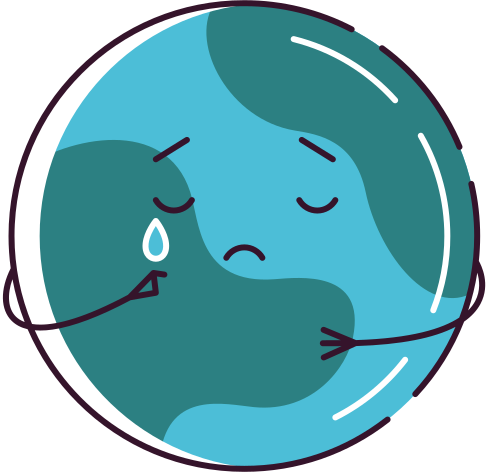
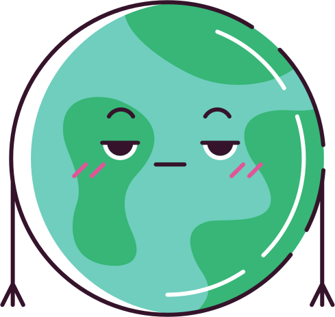
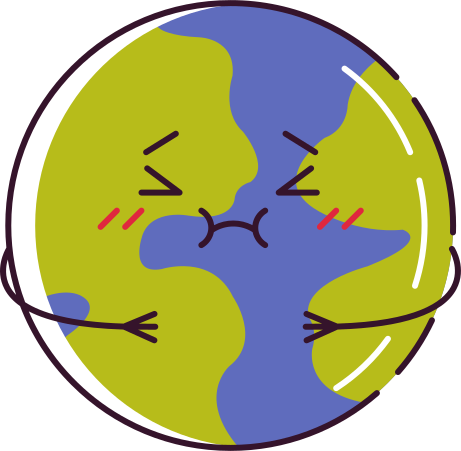
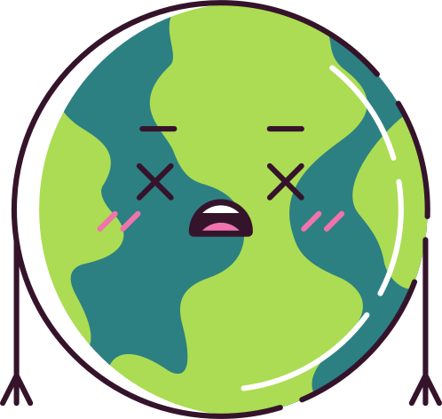

<link rel="apple-touch-icon" sizes="180x180" href="apple-touch-icon.png">
<link rel="icon" type="image/png" sizes="32x32" href="favicon-32x32.png">
<link rel="icon" type="image/png" sizes="16x16" href="favicon-16x16.png">
<link rel="mask-icon" href="safari-pinned-tab.svg" color="#5bbad5">
<meta name="msapplication-TileColor" content="#2b5797">
<meta name="theme-color" content="#ffffff">
<style type="text/css">
@import url('https://fonts.googleapis.com/css2?family=Poppins:wght@300&family=Raleway:wght@400;700&display=swap');
.title{
    display: none;
}

h1.page-title {
  font-family: 'Raleway', sans-serif;
  font-size: 118px;
  color: #7acdf1;
  font-style: normal;
  font-variant: normal;
  text-transform: uppercase;
  font-weight: 700;
}

h3.author{
  font-family: 'Raleway', sans-serif;
  text-decoration: none;
  font-style: normal;
  font-variant: normal;
  text-transform: capitalize;
  font-size:50px;
  color:white;
  margin-left: 10px;
  font-weight:400;
}

h1.section-title{
  font-family: 'Raleway', sans-serif;
  font-weight: 700;
  text-decoration: none;
  font-style: normal;
  font-variant: normal;
  text-transform: uppercase;
  font-size:50px;
  color:#1b3c65;
}

img.earth{
  margin-top: 25px;
  margin-bottom: 10px;
  max-width: 60%;
}

#intro{
    font-family: 'Poppins', sans-serif;
    text-align: left;
    font-size: 23px;
    color: white;
    max-width: 1113px;
    line-height: 1.4;
}

.main-container {
    max-width: 1950px;
    width: 100%;
    margin: 0 auto;
    background-color: #1b3c65;
  }

.bg-blue{
background-color:#98dbf5;
}


.bg-darkblue{
    background-color: #1b3c65;
}

<!-- change background colours and border of carousel -->
button::-moz-focus-inner { border: 0; }
iframe{
  background-color: transparent;
  border-color:transparent
}

.slick-slide {
    background: #ffffff00;
}

plot-container plotly {
 background-color: #ff0000;
}

<!-- change arrow colours -->
.slick-prev:before, .slick-next:before {
    color: #ff0000;
}


</style>
```{r global_options, include=FALSE, message=FALSE, warning=FALSE}

knitr::opts_chunk$set(fig.width=3, fig.height=3, echo = FALSE, warning=FALSE, message=FALSE)
```
<div class="container main-container bg-darkblue">
<div class="row">
  <div class="col-lg-8">
  <h1 class="page-title">Climate Change - Who Cares?</h1>
  <h3 class="page-title author">By: The Climate Changers</h3>
  </div>
  <div class="col-lg-4">
  
  </div>
</div>
<div class="row" style="margin-top: 21px;">
  <div class="col-md-12">
  <h3 id="intro">Climate change is a topic that has been rehashed time and time again, but are people tuning in? Is any real progress being made towards protecting and saving our planet? <br>
This interactive article aims to investigate how people really feel about climate change, what climate change means and how it affects us, and why you too should (or shouldn’t) care about it.</h3>
  </div>
</div>
</div>

<div class="container main-container bg-blue" style="padding:50px;margin-top:30px">
<div class="col-lg-4 ">
<h1 class="section-title">PUBLIC OPINION</h1>
<p>
 

Lorem ipsum dolor sit amet, consectetur adipiscing elit, sed do eiusmod tempor incididunt ut labore et dolore magna aliqua. Ut enim ad minim veniam, quis nostrud exercitation ullamco laboris nisi ut aliquip ex ea commodo consequat. Duis aute irure dolor in reprehenderit in voluptate velit esse cillum dolore eu fugiat nulla pariatur. Excepteur sint occaecat cupidatat non proident, sunt in culpa qui officia deserunt mollit anim id est laborum.
</p>
</div>


<div class="col-lg-8">
```{r}
library(slickR)
library(leaflet)
library(plotly)
library(htmlwidgets)

library(tidyverse)

library(svglite)
library(lattice)
library(ggplot2)
library(rvest) 
library(reshape2)
library(dplyr)

# l <- leaflet() %>% 
#   addTiles()%>%
#   htmlwidgets::saveWidget('leaflet.html')
# 
# leaf_chr <- paste0(readLines('leaflet.html'),collapse='\n')
# 
# leaf_obj <- rep(leaf_chr,2)
# 
# plot_chr <- paste0(readLines('ggplotly.html'),collapse='\n')

natural_disaster<-paste0(readLines('naturaldisaster.html'),collapse='\n')
transport2020HTML<-paste0(readLines('transportation2020.html'),collapse='\n')
transportPredictHTML<-paste0(readLines('transportationPredict.html'),collapse='\n')
figure1html<-paste0(readLines('figure1.html'),collapse='\n')
# p1 = ggplot(iris, aes(x = Species, y = Sepal.Length)) + geom_point()
# p2 = ggplot(iris, aes(x = Species, y = Sepal.Width)) + geom_point()
# htmlwidgets::saveWidget(ggplotly(p1), 'p1.html')
# p1_chr <- paste0(readLines('p1.html'),collapse='\n')
# p1 = xmlSVG({show(p1)}, standalone = TRUE, height = 4, width = 4)  
# p2 = xmlSVG({show(p2)}, standalone = TRUE, height = 4, width = 4)  

# plotsToSVG=list(
#   #Standard Plot
#     #xmlSVG({plot(1:10)},standalone=TRUE),
#   #ggplot
#     xmlSVG({show(ggplot(iris,aes(x=Sepal.Length,y=Sepal.Width,colour=Species))+
#                    geom_point())},standalone=TRUE), 
#   #lattice dotplot
#     xmlSVG({print(dotplot(variety ~ yield | site , data = barley, groups = year,
#                           key = simpleKey(levels(barley$year), space = "right"),
#                           xlab = "Barley Yield (bushels/acre) ",
#                           aspect=0.5, layout = c(1,6), ylab=NULL))
#             },standalone=TRUE) 
# )
# 
# #make the plot self contained SVG to pass into slickR 
# s.in=sapply(plotsToSVG,function(sv){as.character(sv)})

#plot_obj <- list(natural_disaster,leaf_chr,s.in,'infograph layout.png')
plot_obj <- list(figure1html,natural_disaster)
opts <- slickR::settings(slidesToShow =1,infinite = FALSE)

(slickR::slickR(plot_obj,slideType = 'iframe', height=600) + opts)
```
</div>

</div>


<div class="container main-container" style="padding:50px;background-color:#d2d2d1;margin:50px 0px">
<div class="col-lg-8">
```{r}
plot_obj <- list('images/emissions.png','images/temperature.png')
opts <- slickR::settings(slidesToShow =1,infinite = FALSE)

(slickR::slickR(plot_obj,slideType = 'iframe', height=600) + opts)
```

</div>
<div class="col-lg-4">
<h1 class="section-title" style="font-size: 49px;">CURRENT SITUATION</h1>
<p>
As a refresher, the definition of Climate change is "a long-term change in the average weather patterns that have come to define Earth’s local, regional and global climates" according to [NASA](https://climate.nasa.gov/resources/global-warming-vs-climate-change/). Global warming is a big part of climate change, and is caused by higher-than-normal amounts of greenhouse gases in the Earth's atmosphere.
</p>

<p>
 
In the past 30 years, world greenhouse gas emissions have increased by nearly 45% at a rate higher than ever before. In fact, according to [NASA](https://climate.nasa.gov), carbon dioxide, the largest contributor, is at its highest concentration in the air in 650,000 years! These high levels of Carbon dioxide come mainly from human activities (such as burning of fossil fuels, deforestation and livestock farming) and thus fuel the global warming crisis leading to drastic climate changes across the globe such as increasing temperatures and melting ice caps. [Insert interesting insights from temperature and ice mass graphs]
</p>

<p>
With increasing temperatures, the summers are increasingly hot and we use more electricity through fans and air conditioning to keep cool. However, this in turn also releases more carbon emissions into the atmosphere further contributing to global warming and perpetuating this vicious cycle of climate change.
</p>
</div>

</div>


<div class="container main-container bg-blue" style="padding:50px;margin:50px 0px">
<div class="col-lg-4">
<h1 class="section-title" style="font-size: 49px;">EFFECTS ON HUMANS</h1>
<p>
 
Lorem ipsum dolor sit amet, consectetur adipiscing elit, sed do eiusmod tempor incididunt ut labore et dolore magna aliqua. Ut enim ad minim veniam, quis nostrud exercitation ullamco laboris nisi ut aliquip ex ea commodo consequat. Duis aute irure dolor in reprehenderit in voluptate velit esse cillum dolore eu fugiat nulla pariatur. Excepteur sint occaecat cupidatat non proident, sunt in culpa qui officia deserunt mollit anim id est laborum.
</p>
</div>

<div class="col-lg-8">
```{r}
plot_obj <- list(natural_disaster)
opts <- slickR::settings(slidesToShow =1,infinite = FALSE)

(slickR::slickR(plot_obj,slideType = 'iframe', height=600) + opts)
```
</div>

</div>


<div class="container main-container" style="padding:50px;background-color:#d2d2d1;">
<div class="col-lg-8">
```{r}
transport2020HTML<-paste0(readLines('transportation2020.html'),collapse='\n')
transportPredictHTML<-paste0(readLines('transportationPredict.html'),collapse='\n')
actionsHTML<-paste0(readLines('actionsPlot.html'),collapse='\n')
plot_obj <- list(transport2020HTML,transportPredictHTML,actionsHTML)
opts <- slickR::settings(slidesToShow =1,infinite = FALSE)

(slickR::slickR(plot_obj,slideType = 'iframe', height=600) + opts)
```

</div>
<div class="col-lg-4">
<h1 class="section-title" style="font-size: 49px;">WHAT CAN WE DO?</h1>
<p>
Lorem ipsum dolor sit amet, consectetur adipiscing elit, sed do eiusmod tempor incididunt ut labore et dolore magna aliqua. Ut enim ad minim veniam, quis nostrud exercitation ullamco laboris nisi ut aliquip ex ea commodo consequat. Duis aute irure dolor in reprehenderit in voluptate velit esse cillum dolore eu fugiat nulla pariatur. Excepteur sint occaecat cupidatat non proident, sunt in culpa qui officia deserunt mollit anim id est laborum.
</p>
 
</div>

</div>

<div class="col-lg-12">
<h3 id="intro" style="color:#7acdf1;margin-bottom: 50px;">
"THE EARTH IS OUR HOME. LET'S TAKE CARE OF IT."
<h3>
</div>
</div>
